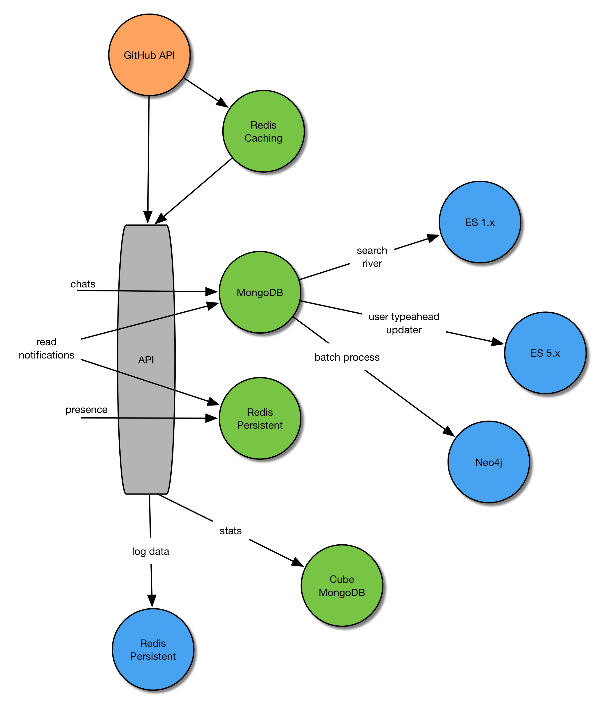

# Gitter-Webapp Walkthrough

## Introduction

`gitter-webapp` is the main monolith for `https://gitter.im` (the Gitter web app), `https://api.gitter.im` (the Gitter API) and `https://ws.gitter.im` (The Gitter realtime socket streaming service).

## Entry Points

There are three server processes:
* [`api.js`](../api.js): serving the API
* [`web.js`](../web.js): serving the web
* [`websockets.js`](../websockets.js): websocket process

## A Bit of History

This repository started as a large monolith and for the most part still is a monolith. Now we are starting to transition to a [monorepo structure](https://lernajs.io/) and over time, more and more functionality will be moved out of the main monolith, into smaller modules.

These modules will initially be kept in the same repo as the monolith, but since they're fairly independent, can move out of the main repo into their own repos as team organization requirements evolve over time.

## Structure

* [`build-scripts/`](../build-scripts): Tools and scripts related to building the application
* [`config/`](../config): Configuration files
* [`modules/`](../modules#modules): Monorepo style submodules
* [`public/`](../public): Public assets for https://gitter.im
* [`redis-lua/`](../redis-lua): Lua scripts for Redis
* [`server/`](../server#server): https://gitter.im backend
* [`shared/`](../shared): Isomorphic Javascript shared by frontend and backend.

## Persistence

Gitter uses a number of backend peristence services:
* **mongodb**: MongoDB is our main database technology. We use [Mongoose](http://mongoosejs.com/) as an ORM.
* **redis**: We are heavy Redis users. We have four main Redis clusters. These are for:
  * **redis-persist**: Persistent Redis instant. If the cluster went down, ideally we should not lose any data.
  * **redis-nonpersist**: Non-persistent Redis. If the cluster went down and we lost all data in this cluster, it would not affect the operation of Gitter.
  * **redis-caching**: Similar to redis-nonpersist, but capped in size. Used for caching, particularly the **GitHub API**, which we cache using the [`request-http-cache`](https://github.com/gitterHQ/request-http-cache) module.
  * **redis-faye**: Used by [Faye](https://github.com/faye/faye) as a peristent backend.
* **elasticsearch**
* **neo4j**:

## Diagrams

### Overview

### Software Architecture

### Dataflow

### Infrastructure

